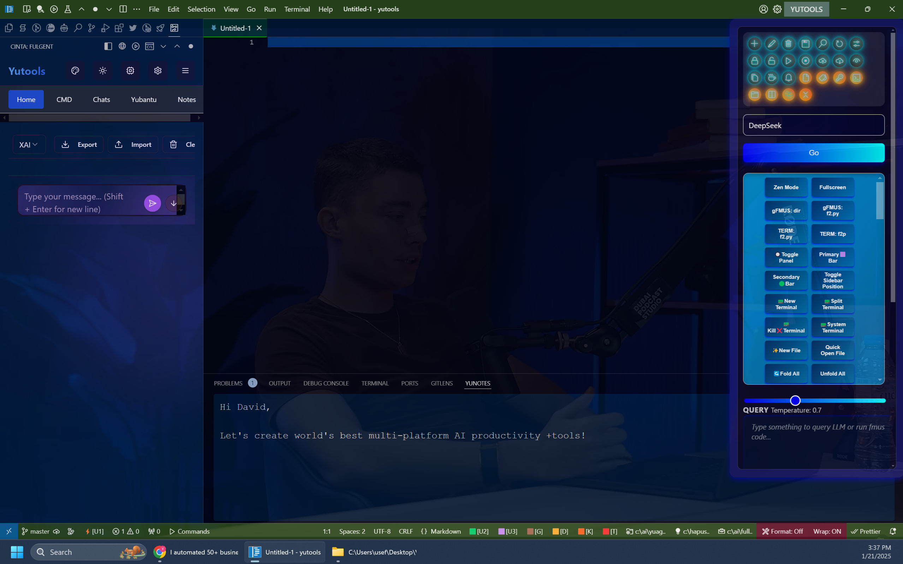
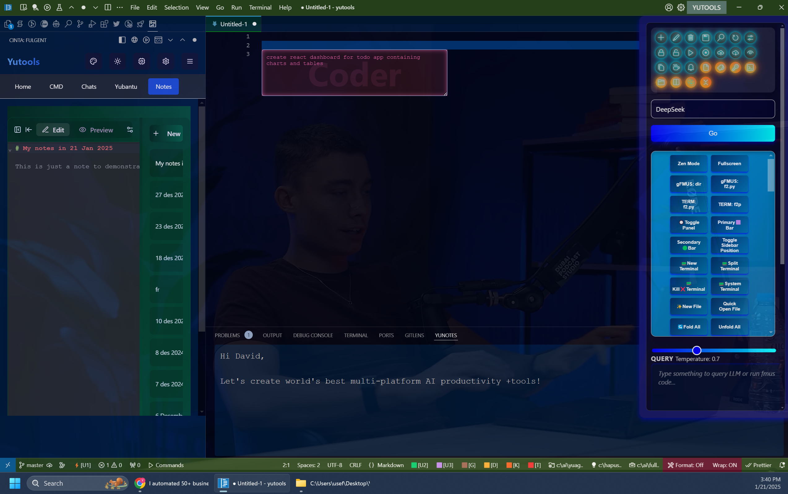
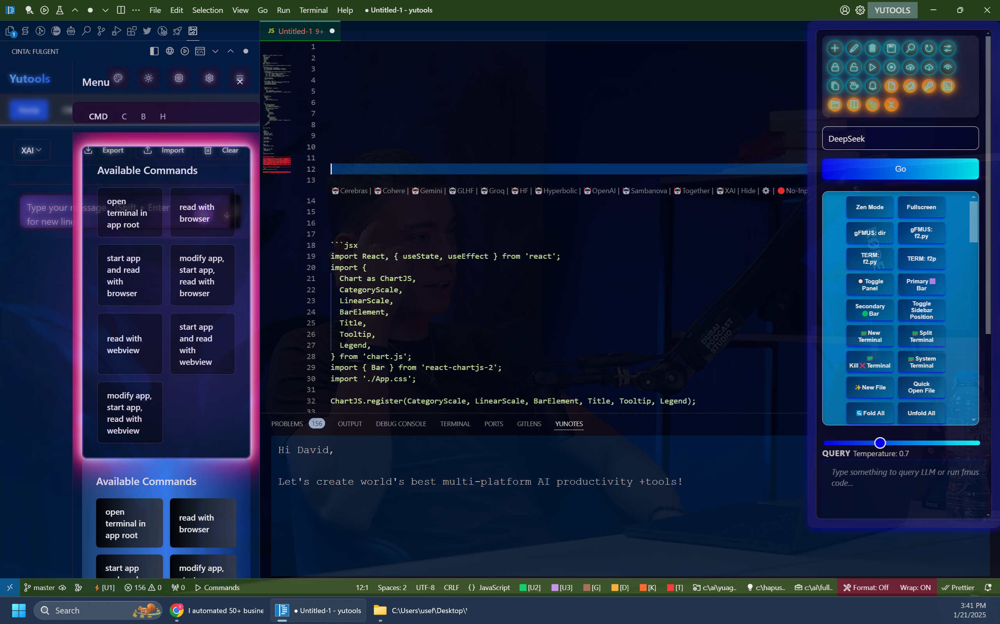
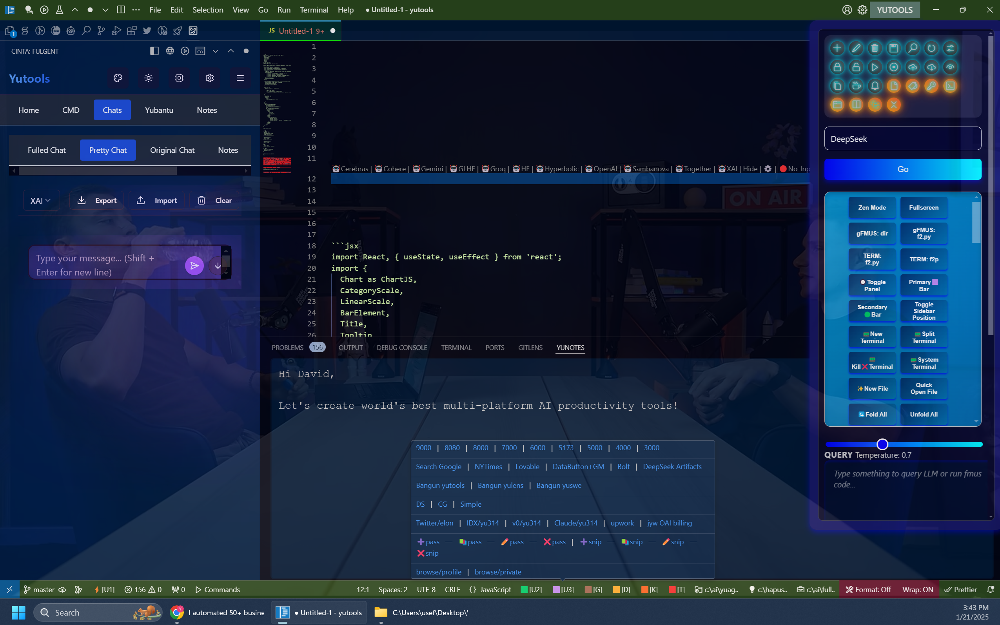

# What is Yutools
**Your Swiss Army Knife for VS Code**  

Yutools is a powerful VS Code extension designed to supercharge your development workflow. Packed with AI-powered tools, file management utilities, terminal integrations, and DevOps automation, Yutools helps you get more done with less hassle. Whether you're writing code, managing databases, or deploying to the cloud, Yutools has you covered.

# Demo Video

Here's a quick "Hello, World" demo of fmuscmd in action:

[Watch the video on YouTube](https://www.youtube.com/watch?v=Xi4b1SYuX7A)

---

### Main View
<figure>
  
  <figcaption style="font-style: italic;">Yutools has many features on the extension view on the left, including notes on bottom panel. It also has built-in button menus and Quick LLM query box from top right menu. In addition, there are a lot of menu items on editor title bar, activity bar, and explorer bar.</figcaption>
</figure>

---

### Quick coder
<figure>
  
  <figcaption style="font-style: italic;">Easily bind in-context coder box (single line and multi line) to generate code quickly on where the cursor is.</figcaption>
</figure>

---

### Sleek extension view UI
<figure>
  
  <figcaption style="font-style: italic;">Various commands from extension view can be activated with sleek UI.</figcaption>
</figure>

---

### Powered status bar
<figure>
  
  
  <figcaption style="font-style: italic;">Status bar also powered with menu where different commands can be put inside.</figcaption>
</figure>

---

## Features

### 🧠 **AI-Powered Development**
- **Code Completion & Refactoring**: Leverage LLMs like OpenAI, Anthropic, and Gemini for smarter coding.  
- **Documentation Generation**: Automatically generate docs with AI assistance.  
- **Multimodal AI**: Analyze images and perform context-aware tasks.  

### 🗂️ **File & Workspace Management**
- Easily navigate, create, and manage files and directories.  
- Open files in splits, manage tabs, and streamline your workspace.  

### 💻 **Terminal Integration**
- Run commands, open terminals, and automate repetitive tasks.  
- Supports PowerShell, CMD, and custom terminal commands.  

### 🛠️ **DevOps & Automation**
- **Docker**: Manage containers and images directly from VS Code.  
- **GitHub Actions**: Automate CI/CD workflows.  
- **Cloud Deployments**: Deploy to GCP, Koyeb, Railway, and more.  

### 🗄️ **Database Connectivity**
- Connect to MongoDB, MySQL, PostgreSQL, Redis, and Supabase.  
- Run queries, manage schemas, and visualize data.  

### 🎨 **Many more!**
- Built-in tools for tweeting, prompt management, and more.  

---

## Installation

1. Clone the repository
2. Compile
3. Run as development: `scripts\code.bat`
4. Compile as binary `npm run gulp vscode-win32-x64`

---

## Usage

Once installed, Yutools integrates seamlessly into your VS Code workflow. Here are some quick ways to get started:  

- **AI Tools**: Use the command palette (`Ctrl+Shift+P`) and search for "AI Code Suggestions" or "Generate Documentation."  
- **File Management**: Right-click in the Explorer view to access file and directory utilities.  
- **Terminal Commands**: Open a terminal and use `Yutools` commands to automate tasks.  
- **Database Connections**: Use the database panel to connect and query your databases.  

---

## Contributing  

We welcome contributions! If you'd like to contribute to Yutools, please follow these steps:  

1. Fork the repository.  
2. Create a new branch (`git checkout -b feature/YourFeatureName`).  
3. Commit your changes (`git commit -m 'Add some feature'`).  
4. Push to the branch (`git push origin feature/YourFeatureName`).  
5. Open a pull request.  

---

## License  

This project is licensed under the MIT License. See the [LICENSE](LICENSE) file for details.  

---

## Feedback  

Have questions, suggestions, or feedback? Open an issue on GitHub or reach out to us at [yusef314159@gmail.com].  

---

**Yutools** is here to make your coding life easier. Give it a try and let us know what you think! 🚀  
